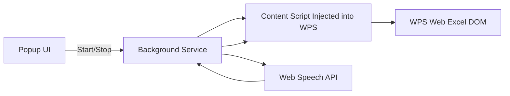

下面是 **适配 WPS 云端表格（WPS 网页版 Excel）** 的专业级 **完整技术方案（Markdown 版）**，包含业务流程、技术栈、架构、模块设计、数据结构、关键算法、风险控制、测试方案等。
可直接作为立项文档 / 技术评审文档使用。

---

# # 📘 项目名称：**VoiceSheet Navigator**

**一句话简介**：
在 WPS 云端表格中，通过语音输入学生姓名与分数，实现智能定位行列并自动填入成绩，全流程 **纯端侧，无需服务器**。

---

# # 1. ⭐ 项目背景与核心目标

## 1.1 背景

教师在录入成绩时，传统的 Excel 手动操作耗时效率低。WPS 云端 Excel 无法运行 VBA/宏、无插件体系，且云端权限限制多。

本方案旨在：

* 实现在 WPS 云端表格中 **通过语音快速录分**
* 兼容 **浏览器环境**（Chrome / Edge）
* **纯端侧运行，无需服务器**
* 无需更改 WPS 表格后台，无额外权限

---

## 1.2 核心目标

| 功能            | 描述                |
| ------------- | ----------------- |
| **语音识别（中文）**  | 浏览器本地识别姓名 + 分数    |
| **自动定位学生所在行** | 在姓名列查找与语音匹配的学生    |
| **自动匹配当前学科列** | 根据当前选中单元格所在列确定填分列 |
| **自动填入成绩**    | 模拟用户操作，对目标单元格填值   |
| **纯端侧运行**     | 不依赖后端/服务器/API     |

---

# # 2. ⭐ 总体业务流程

```mermaid
flowchart TD
    A[开启 Chrome 插件] --> B[Web Speech API 开始监听语音]
    B --> C[识别文本，如“李四 89”]
    C --> D[解析文本 → {name: 李四, score: 89}]
    D --> E[插件扫描 WPS 表格 DOM]
    E --> F[在姓名列匹配到“李四”所在行]
    F --> G[读取用户当前选中的列（当前学科）]
    G --> H[定位 (row, col) 单元格]
    H --> I[自动填入成绩 89]
    I --> J[等待下一次语音]
```

---

# # 3. ⭐ 关键技术选型（技术栈）

| 模块          | 技术方案                         | 说明           |
| ----------- | ---------------------------- | ------------ |
| **语音识别**    | Web Speech API（Chrome 内置）    | 纯本地，低延迟      |
| **浏览器扩展开发** | Chrome Extension Manifest V3 | 都在本地运行       |
| **主逻辑脚本**   | Content Script (JavaScript)  | 操作 WPS DOM   |
| **UI 组件**   | Popup.html + CSS             | 启停语音、状态提示    |
| **数据存储**    | chrome.storage.local         | 存储配置，如姓名列索引  |
| **页面交互**    | DOM Query + execCommand      | 填分与定位        |
| **名字匹配**    | 正则与近似匹配（支持容错）                | 避免识别错误导致定位失败 |

---

# # 4. ⭐ 产品业务设计

## 4.1 功能列表

| 功能        | 状态 | 描述            |
| --------- | -- | ------------- |
| 语音监听开关    | ✔  | 插件 Popup 控制   |
| 语音识别转文本   | ✔  | 自动监听中文输入      |
| 姓名 & 分数解析 | ✔  | 提取姓名 + 数字     |
| 姓名列配置     | ✔  | 默认列 B，可自定义    |
| 自动搜索学生行   | ✔  | DOM 扫描名字列     |
| 定位当前列     | ✔  | 监听当前选中单元格     |
| 自动填分      | ✔  | 自动输入识别到的成绩    |
| 容错处理      | ✔  | 识别模糊名字、异常提醒   |
| 日志/调试模式   | ✔  | 方便排查 DOM 结构变化 |

---

## 4.2 用户操作流程（教师角度）

1. 打开 WPS 云端表格
2. 在当前学科列随意点击一个单元格（作为当前列）
3. 点击浏览器右上角插件图标 → “Start Voice Input”
4. 对着麦克风说：
   **“张三 89 分”**
5. 插件自动：

   * 找到“张三”所在行
   * 找到当前学科列
   * 填入分数
6. 自动等待下一次语音输入
7. 全部录完后，点击“Stop”结束

---

# # 5. ⭐ 系统架构设计



---

# # 6. ⭐ 模块设计（最关键部分）

## 6.1 Web Speech API 模块

```js
const recognition = new webkitSpeechRecognition();
recognition.lang = "zh-CN";
recognition.interimResults = false;

recognition.onresult = (event) => {
  const text = event.results[0][0].transcript;
  chrome.runtime.sendMessage({ type: "VOICE_TEXT", text });
};
```

---

## 6.2 文本解析模块（Content Script）

目标文本格式：

* “张三 89”
* “李四，87 分”
* “王小明 得分 92”

### 正则解析

```js
function parseInput(text) {
  const match = text.match(/([\u4e00-\u9fa5]{2,})\D*(\d{1,3})/);
  if (!match) return null;
  return { name: match[1], score: Number(match[2]) };
}
```

---

## 6.3 姓名定位模块

假设用户设置姓名列为 B（第 2 列）：

```js
function findRowIndexByName(name) {
  const cells = document.querySelectorAll('[data-row][data-col="2"]');

  for (let cell of cells) {
    if (cell.innerText.trim() === name) {
      return cell.dataset.row;
    }
  }
  return null;
}
```

---

## 6.4 当前选中列捕获模块

监听单元格点击事件：

```js
let currentCol = null;

document.addEventListener('click', e => {
  const cell = e.target.closest('[data-row][data-col]');
  if (cell) currentCol = cell.dataset.col;
});
```

---

## 6.5 自动填分模块

```js
function fillScore(row, col, score) {
  const cell = document.querySelector(`[data-row="${row}"][data-col="${col}"]`);
  if (cell) {
    cell.click();
    document.execCommand("insertText", false, String(score));
  }
}
```

---

# # 7. ⭐ 数据结构

| 名称            | 类型     | 示例                        | 说明             |
| ------------- | ------ | ------------------------- | -------------- |
| VoiceResult   | Object | `{name: "张三", score: 89}` | 语音解析后的数据       |
| StudentRow    | Number | `12`                      | 在 WPS DOM 中的行号 |
| CurrentColumn | Number | `5`                       | 当前所录学科列        |
| Config        | Object | `{ nameColumn: 2 }`       | 用户自定义配置        |

---

# # 8. ⭐ Chrome 插件目录结构

```
voice-sheet-navigator/
├── manifest.json
├── popup/
│   ├── popup.html
│   ├── popup.js
│   └── popup.css
├── background/
│   └── background.js
├── content/
│   └── content-script.js
└── assets/
    └── icon.png
```

---

# # 9. ⭐ manifest.json（核心）

```json
{
  "manifest_version": 3,
  "name": "VoiceSheet Navigator",
  "version": "1.0",
  "description": "Voice-controlled score entry for WPS spreadsheets.",
  "permissions": ["storage"],
  "background": {
    "service_worker": "background/background.js"
  },
  "action": {
    "default_popup": "popup/popup.html"
  },
  "content_scripts": [
    {
      "matches": ["https://*.wps.cn/*", "https://*.kdocs.cn/*"],
      "js": ["content/content-script.js"]
    }
  ]
}
```

---

# # 10. ⭐ 风险与解决方案

| 风险              | 原因                  | 解决方案                    |
| --------------- | ------------------- | ----------------------- |
| WPS 云端 DOM 结构变动 | WPS 更新前端            | 设置 DOM 容错 / 提供 Debug 模式 |
| 语音误识别姓名         | Web Speech API 精度波动 | 加“姓名匹配确认提示”可选项          |
| 单元格定位失败         | 表格合并单元格             | 提供手动重新选列功能              |
| 浏览器权限问题         | 麦克风拒绝授权             | 启动时检测麦克风权限              |

---

# # 11. ⭐ 测试方案

## 11.1 单元测试

| 模块       | 测试点          |
| -------- | ------------ |
| 文本解析模块   | 正则提取正确、错误、异常 |
| DOM 定位模块 | 找到对应行/列      |
| 自动填分模块   | 正常输入、覆盖输入    |

## 11.2 集成测试

* 在 WPS 云表格上实际测试
* 10 个学生，3 个科目，录 30 条语音
* 统计成功率 ≥ 95%

## 11.3 性能测试

* 连续录入 50 次语音操作
* 无明显延迟，无内存泄漏

---

# # 12. ⭐ 后续扩展方向

* 支持 **模糊匹配学生姓名**（解决声学识别误差）
* 支持 **语音连续模式**（无需每次停顿）
* 支持 **自定义命令**（如“下一位”“上一行”）
* 支持 **iPad + WPS 小程序** 端侧录分（MiniApp + Whisper.cpp）

---

# # 13. ⭐ 结论

本技术方案完全适配 **WPS 云端表格** 的限制，通过 Chrome 插件 + 本地语音识别，实现 “喊名字 → Excel 定位 → 自动填分”，可稳定运行、完全本地化、不依赖任何服务器。

---

## 📂 代码实现与使用方式

仓库新增了可直接加载的 Chrome 扩展 **VoiceSheet Navigator**（路径：`voice-sheet-navigator/`），实现文档中的端侧语音录分流程：

1. 打开 Chrome 的“加载已解压的扩展程序”，选择 `voice-sheet-navigator/` 目录。
2. 在 WPS/金山文档云端表格页面点击某一学科列的任意单元格，让扩展记录当前列。
3. 打开扩展弹窗，点击“开始监听”，对着麦克风说出“学生姓名 + 分数”（例如“张三 89 分”）。
4. 扩展使用 Web Speech API 转文本后，在姓名列中模糊匹配对应行，并将分数填入当前列。
5. 若表格 DOM 发生变化，可在弹窗中调整“姓名所在列”或打开调试日志排查。

### 🛠️ 运行流程（端到端）

1. **安装扩展**：在浏览器地址栏输入 `chrome://extensions/`，开启“开发者模式”，点击“加载已解压的扩展程序”，选择仓库内的 `voice-sheet-navigator/` 目录。
2. **授权麦克风**：首次启动语音监听时，按浏览器提示允许麦克风访问，避免语音识别被阻止。
3. **进入 WPS 表格页面**：在 WPS/金山文档云端表格中，点击目标学科列任意单元格，记录当前列索引。
4. **设置姓名列**（可选）：在插件弹窗中设置“姓名所在列”（默认 B 列 = 2），并保存到本地存储。
5. **启动语音录分**：点击弹窗内的“开始监听”按钮，对着麦克风连续说出“学生姓名 + 分数”（示例：“李四 92 分”）。
6. **自动填入**：内容脚本在姓名列匹配到对应行后，将分数写入当前列目标单元格，并在弹窗状态区提示成功或报错信息。
7. **暂停或结束**：录分结束点击“停止监听”；若遇到 DOM 变化或误识别，可重新选中目标列或调整姓名列后再次开始。

若录音设备不可用或便于调试，可在弹窗下方使用 **“手动调试”** 输入姓名与分数，点击“发送至当前列”以验证行定位与写入逻辑。
